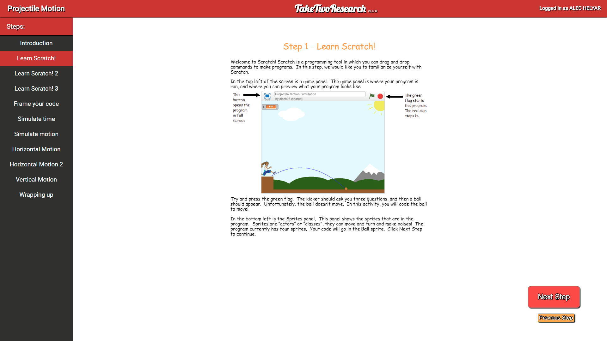
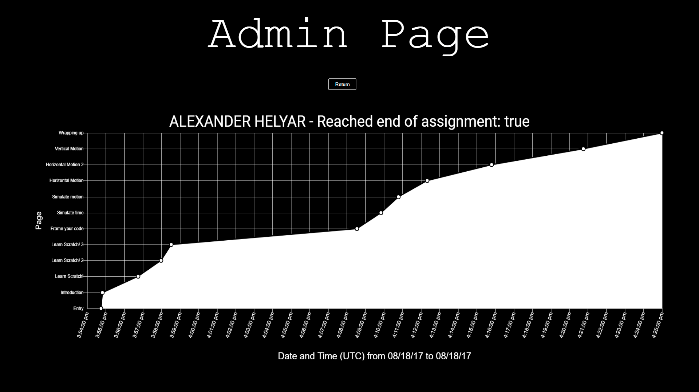

# RET Instruction Website
This is a repository for a web application designed for my NC State RET research team over the summer of 2017.  
## RET Research at NC State - [engr.ncsu.edu/outreach/ret/](https://www.engr.ncsu.edu/outreach/ret/)
My research team was a stratified team consisting of a high school physics teacher, a community college calculus teacher, a teaching undergraduate student, a computer engineering undergraduate student, and myself, a computer science undergraduate student.  The purpose of our research was twofold: 
1. Discover new ways to incorporate engineering design principles into K-12 curriculum. 
2. Determine the effects of using computer science principles to program a simulation on student satisfaction, engagement, and comprehension of material as opposed to simply working with a simulation.

Early on in the program, we decided that we needed a streamlined, robust platform for us to create and test our lesson plans.  I created this website so that teachers could create and edit their lesson plans on platforms that they understood, which was Google Docs in this case, while I compiled our work onto an easily accessible website.  Choosing to develop this web application allowed us to track and record each student's progression through the lesson, create and edit lesson plans on the fly, and pack our work onto one page.  The application uses Google's App Engine to run on the cloud, and uses Google's DataStore (NoSQL) for its database.  Currently on the website is a physics projectile motion activity which aligns with many education standards, including Common Core.  The full materials for the activity will be uploaded to [teachengineering.org](https://www.teachengineering.org/), a digital library of educational activities for teachers.

## Design

## Built With
[Maven](https://maven.apache.org/) - Dependency Management
[Chart.js](http://www.chartjs.org/) - Data analsysis
[Google Cloud](https://cloud.google.com/) - Platform hosting and Database management

## License
This project is licensed under the MIT License - see [LICENSE.md](License.md).

## Latest Version
### 3.0.0:
* Improved browser support for IE users.
* Added scrolling functionality for smaller screens
* Fixed HTTP requests from mobile clients
* Added new Admin Page for teachers to view their students when they sign in:

